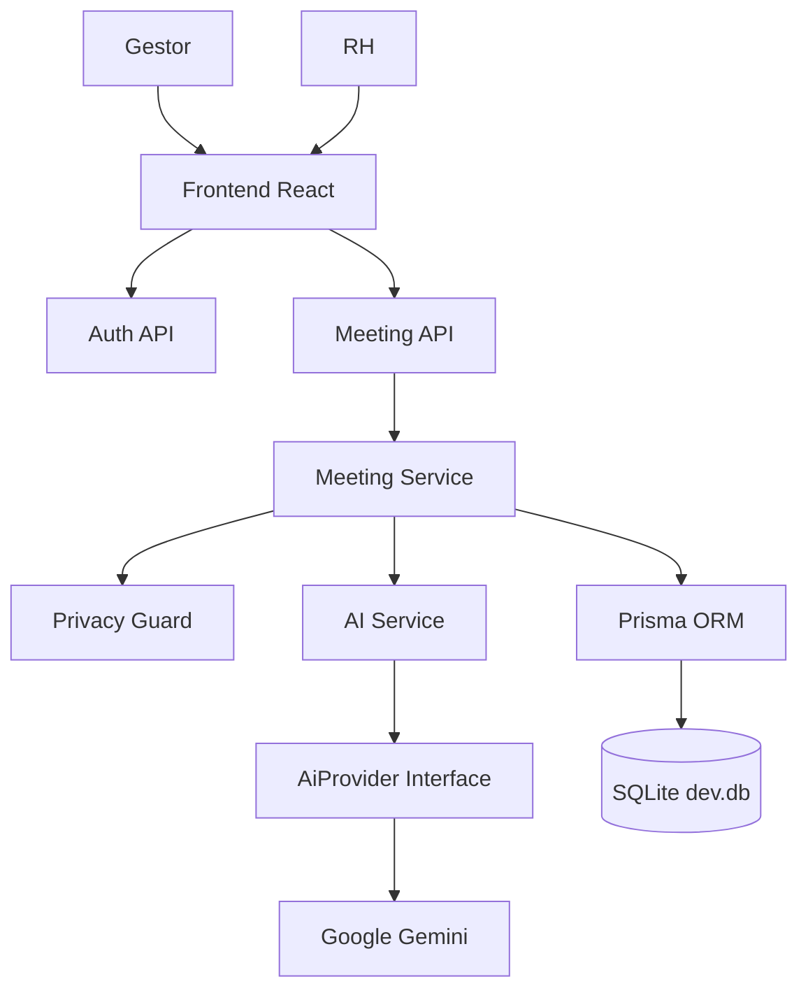

# Technical Context - ClearIT 1:1 & Feedback AI Assistant

> Este arquivo é a fonte de verdade para Engenharia. O agente `@engineer` atualizará este arquivo quando houver mudanças na arquitetura. Ele foi projetado com foco em tecnologias baseadas em TypeScript, mantendo um setup local simples e sem atritos.

---

## 1. Stack Tecnológica (Foco em TypeScript e Simplicidade)

Escolhemos uma stack inteiramente baseada em TypeScript com configuração simplificada de banco de dados local:

*   **Linguagem:** TypeScript tanto no Frontend quanto no Backend, garantindo tipagem estática e detecção precoce de erros.
*   **Frontend:** React (Vite + TypeScript) + Tailwind CSS. Desenvolvimento rápido e leve com arquivos `.tsx`.
*   **Backend:** Node.js com Express + TypeScript (executado via `tsx` runner para desenvolvimento direto sem build manual).
*   **Banco de Dados:** SQLite (rodando localmente via arquivo `dev.db`, sem necessidade de instalar servidores de banco).
*   **ORM:** Prisma ORM. Totalmente integrado ao TypeScript, fornecendo tipos automáticos baseados no schema do banco, além do editor visual *Prisma Studio*.
*   **Inteligência Artificial:** SDK Oficial do Google Gemini (`@google/genai`).
*   **Relatórios:** React-PDF (`@react-pdf/renderer`) no Frontend para geração estruturada, customização visual e exportação direta de PDFs.
*   **Gerenciamento:** Monorepo simples com `concurrently` na raiz para rodar o frontend e o backend com `npm run dev`.

---

## 2. Estrutura de Pastas (Monorepo TypeScript)

```text
clearit-the_cure/
├── docs/                   # Documentação (Contextos, Ciclos e Sessões)
├── backend/                # Servidor API em TypeScript
│   ├── prisma/             # Configuração do Prisma & SQLite
│   │   ├── schema.prisma
│   │   └── dev.db          # Arquivo do banco (gerado automaticamente)
│   ├── src/
│   │   ├── controllers/    # Controladores (TS)
│   │   ├── routes/         # Rotas (TS)
│   │   └── index.ts        # Ponto de entrada (TS)
│   ├── tsconfig.json       # Configuração do TypeScript no Backend
│   └── package.json
├── frontend/               # Cliente React em TypeScript
│   ├── src/
│   │   ├── components/     # Componentes React (TSX)
│   │   ├── pages/          # Telas (TSX)
│   │   ├── App.tsx         # Rotas do cliente
│   │   └── main.tsx
│   ├── tsconfig.json       # Configuração do TypeScript no Frontend
│   └── package.json
├── package.json            # Script central para rodar ambos
└── README.md
```

---

## 3. Padrões de Código (Code Standards)

1.  **Nomenclatura:**
    *   **Arquivos e Pastas:** `kebab-case` (ex: `feedback-form.tsx`, `auth-middleware.ts`).
    *   **Componentes React:** `PascalCase` (ex: `FeedbackCard.tsx`).
    *   **Variáveis, Funções e Tipos/Interfaces:** `camelCase` para variáveis e funções; `PascalCase` para `type` e `interface` (ex: `interface EmployeeData`).
    *   **Prisma:** Tabelas em singular e `PascalCase` (ex: `model FeedbackLog`), colunas em `camelCase`.
2.  **Tratamento de Erros:**
    *   Uso de blocos `try/catch` obrigatório em chamadas assíncronas (`async/await`) no frontend e backend.
    *   Tratamento de tipos (`unknown` ou asserções adequadas) em blocos de erro para manter o TypeScript estrito.
3.  **Segurança (LGPD) e Variáveis de Ambiente:**
    *   Variáveis sensíveis sempre em arquivos `.env` locais (nunca commitados).
    *   Utilizar `process.env` no Node e `import.meta.env` no Vite.

---

## 4. Arquitetura Lógica

```mermaid
graph TD
    User([Líder / Gestor]) <--> |Interface Web (TSX)| FE[Frontend React TS + Tailwind]
    FE <--> |Chamadas HTTP API / JSON| BE[Backend Node TS + Express]
    BE <--> |Leitura/Escrita Tipada| DB[(Banco de Dados SQLite via Prisma)]
    BE <--> |Validação e Polimento| Gemini[API Google Gemini]
```

---

## 5. Próximos Passos (Bootstrap do Projeto)

Para iniciarmos a implementação das especificações que estão prontas para Dev no `business-context-lite.md`, realizaremos os seguintes passos:

### Passo 1: Inicializar Monorepo
Configurar o `package.json` raiz com as dependências do `concurrently` para orquestrar a execução do frontend e backend simultaneamente.

### Passo 2: Inicializar o Backend Express + TypeScript
1. Configurar o diretório `backend/`, instalar dependências (`express`, `cors`, `dotenv`, `@prisma/client`) e ferramentas de desenvolvimento (`typescript`, `@types/node`, `@types/express`, `tsx`).
2. Configurar o `tsconfig.json` e inicializar o Prisma com SQLite: `npx prisma init --datasource-provider sqlite`.
3. Modelar as entidades (`User`, `Employee`, `MeetingLog`, `Feedback`, `ActionItem` e `PdiObjective`) no schema do Prisma e rodar a migration inicial.

### Passo 3: Inicializar o Frontend React + TypeScript
1. Criar o diretório `frontend/` usando o template `react-ts` do Vite.
2. Configurar o Tailwind CSS e instalar dependências de ícones e rotas.

### Passo 4: Codificar Roteiros guiados (F-01 e F-02)
Implementar a lógica de formulários estruturados em TypeScript e validar dados sensíveis antes de salvar no SQLite e polir com a API de IA.

---

## 6. Plano Técnico — F-01: Preparação & Estruturação de Reuniões de 1:1

> **Status:** Planejado para implementação  
> **Persona:** @engineer  
> **Base de Produto:** F-01 — Preparação & Estruturação de Reuniões de 1:1  
> **Decisões confirmadas:** login próprio, usuários gestores e RH, SQLite no MVP, Google Gemini com abstração para troca futura, interface pt-BR principal e inglês secundário, preparo antes da reunião e conclusão depois.

### 6.1 Objetivo Técnico

Implementar o primeiro fluxo central do produto: permitir que gestores preparem, conduzam, registrem e concluam reuniões de 1:1 estruturadas em cinco blocos obrigatórios, com apoio de IA, registro rastreável e validações mínimas de segurança e LGPD.

A F-01 será a fundação para features posteriores como feedback estruturado, PDI, exportação, analytics e análise de histórico.

---

### 6.2 Escopo da F-01

#### Dentro do escopo

- Login próprio com e-mail e senha.
- Perfis de acesso iniciais:
  - `MANAGER`
  - `HR`
- Cadastro/listagem simples de colaboradores.
- Criação de reunião de 1:1.
- Preparação prévia da pauta.
- Preenchimento durante ou após a reunião.
- Wizard com os cinco blocos obrigatórios:
  1. Check-in Humano
  2. Pauta do Liderado
  3. Status de Entregas e Obstáculos
  4. Desenvolvimento, Carreira e Feedback
  5. Acordos e Próximos Passos
- Validação obrigatória de acordos com responsável e prazo.
- Sugestão de cadência ideal: quinzenal ou mensal.
- Geração assistida por IA usando Google Gemini.
- Camada de abstração para permitir troca futura do provedor de IA.
- Interface em português como idioma principal.
- Estrutura preparada para inglês como idioma secundário.

#### Fora do escopo nesta etapa

- Login Microsoft/Google.
- Permissões avançadas por área, squad ou departamento.
- Exportação PDF/Excel completa.
- Painel Analytics do RH.
- PDI completo.
- Feedback SBI completo.
- Importação/análise de PDFs legados.
- Migração para PostgreSQL.

---

### 6.3 Decisões Arquiteturais

| Tema | Decisão | Justificativa |
|---|---|---|
| Autenticação | Login próprio com e-mail e senha | Reduz dependências externas no MVP e acelera validação |
| Perfis | Gestores e RH | Cobre os principais usuários do processo sem ampliar demais o escopo |
| Banco | SQLite via Prisma | Simples para MVP/PoC e compatível com migração futura |
| IA | Google Gemini | Já validado na PoC, mas acessado via interface abstrata |
| Provider de IA | `AiProvider` desacoplado | Permite trocar Gemini futuramente sem reescrever regras de negócio |
| Idiomas | pt-BR principal, en-US secundário | Atende uso local e prepara expansão |
| Fluxo da 1:1 | Preparar antes e concluir durante/depois | Reflete o comportamento real dos gestores |
| UI | Wizard guiado por etapas | Reduz atrito e evita 1:1 focada só em operacional |

---

### 6.4 Arquitetura da Feature



---

### 6.5 Modelo de Domínio Inicial

#### Entidades principais

- `User`
- `Employee`
- `OneOnOneMeeting`
- `MeetingSection`
- `MeetingQuestion`
- `MeetingAnswer`
- `ActionItem`
- `AiSuggestion`

#### Relações

- Um `User` gestor pode conduzir várias `OneOnOneMeeting`.
- Um `Employee` pode ter várias reuniões.
- Uma reunião possui cinco `MeetingSection`.
- Cada seção pode conter perguntas e respostas.
- Uma reunião deve ter pelo menos um `ActionItem` para ser concluída.
- Sugestões de IA podem ser salvas como apoio, mas não substituem a decisão humana.

---

### 6.6 Modelo Prisma Proposto

```prisma
enum UserRole {
  MANAGER
  HR
}

enum MeetingStatus {
  DRAFT
  PREPARED
  IN_PROGRESS
  COMPLETED
  CANCELLED
}

enum MeetingSectionType {
  HUMAN_CHECKIN
  EMPLOYEE_AGENDA
  DELIVERIES_AND_BLOCKERS
  DEVELOPMENT_AND_FEEDBACK
  AGREEMENTS_AND_NEXT_STEPS
}

enum Locale {
  PT_BR
  EN_US
}

model User {
  id           String   @id @default(cuid())
  name         String
  email        String   @unique
  passwordHash String
  role         UserRole
  locale       Locale   @default(PT_BR)
  createdAt    DateTime @default(now())
  updatedAt    DateTime @updatedAt

  meetingsLed OneOnOneMeeting[] @relation("MeetingLeader")
}

model Employee {
  id        String   @id @default(cuid())
  name      String
  email     String?
  roleTitle String?
  area      String?
  active    Boolean  @default(true)
  createdAt DateTime @default(now())
  updatedAt DateTime @updatedAt

  meetings OneOnOneMeeting[]
}

model OneOnOneMeeting {
  id              String        @id @default(cuid())
  leaderId        String
  employeeId      String
  status          MeetingStatus @default(DRAFT)
  locale          Locale        @default(PT_BR)
  scheduledAt     DateTime?
  startedAt       DateTime?
  completedAt     DateTime?
  durationMinutes Int?
  preparationNote String?
  cadenceSuggestion String?
  summary         String?
  createdAt       DateTime      @default(now())
  updatedAt       DateTime      @updatedAt

  leader   User     @relation("MeetingLeader", fields: [leaderId], references: [id])
  employee Employee @relation(fields: [employeeId], references: [id])

  sections      MeetingSection[]
  actionItems   ActionItem[]
  aiSuggestions AiSuggestion[]
}

model MeetingSection {
  id        String             @id @default(cuid())
  meetingId String
  type      MeetingSectionType
  title     String
  position  Int
  completed Boolean            @default(false)
  notes     String?
  createdAt DateTime           @default(now())
  updatedAt DateTime           @updatedAt

  meeting   OneOnOneMeeting @relation(fields: [meetingId], references: [id])
  questions MeetingQuestion[]

  @@unique([meetingId, type])
}

model MeetingQuestion {
  id        String   @id @default(cuid())
  sectionId String
  text      String
  required  Boolean  @default(false)
  position  Int
  createdAt DateTime @default(now())

  section MeetingSection @relation(fields: [sectionId], references: [id])
  answers MeetingAnswer[]
}

model MeetingAnswer {
  id         String   @id @default(cuid())
  questionId String
  answer     String
  createdAt  DateTime @default(now())
  updatedAt  DateTime @updatedAt

  question MeetingQuestion @relation(fields: [questionId], references: [id])
}

model ActionItem {
  id          String   @id @default(cuid())
  meetingId   String
  description String
  owner       String
  dueDate     DateTime
  completed   Boolean  @default(false)
  createdAt   DateTime @default(now())
  updatedAt   DateTime @updatedAt

  meeting OneOnOneMeeting @relation(fields: [meetingId], references: [id])
}

model AiSuggestion {
  id        String   @id @default(cuid())
  meetingId String
  provider  String
  purpose   String
  inputHash String?
  content   String
  accepted  Boolean?
  createdAt DateTime @default(now())

  meeting OneOnOneMeeting @relation(fields: [meetingId], references: [id])
}
```

---

### 6.7 Backend — APIs Planejadas

#### Auth

```http
POST /api/auth/register
POST /api/auth/login
GET  /api/auth/me
POST /api/auth/logout
```

#### Employees

```http
POST /api/employees
GET  /api/employees
GET  /api/employees/:id
PUT  /api/employees/:id
```

#### One-on-One Meetings

```http
POST /api/meetings
GET  /api/meetings
GET  /api/meetings/:id
PUT  /api/meetings/:id
POST /api/meetings/:id/prepare
POST /api/meetings/:id/sections/:sectionId/answers
POST /api/meetings/:id/action-items
POST /api/meetings/:id/complete
```

#### AI

```http
POST /api/ai/one-on-one/prepare
POST /api/ai/one-on-one/summarize
POST /api/ai/one-on-one/suggest-cadence
```

---

### 6.8 Serviços Backend

```text
backend/src/
├── modules/
│   ├── auth/
│   │   ├── auth.controller.ts
│   │   ├── auth.routes.ts
│   │   ├── auth.service.ts
│   │   └── password.service.ts
│   ├── employees/
│   │   ├── employee.controller.ts
│   │   ├── employee.routes.ts
│   │   └── employee.service.ts
│   ├── meetings/
│   │   ├── meeting.controller.ts
│   │   ├── meeting.routes.ts
│   │   ├── meeting.service.ts
│   │   ├── meeting-template.service.ts
│   │   └── meeting-validation.service.ts
│   ├── ai/
│   │   ├── ai.controller.ts
│   │   ├── ai.routes.ts
│   │   ├── ai.service.ts
│   │   ├── ai-provider.ts
│   │   └── providers/
│   │       └── gemini.provider.ts
│   └── privacy/
│       ├── privacy-guard.service.ts
│       └── sensitive-data-patterns.ts
├── prisma/
│   └── prisma-client.ts
└── index.ts
```

---

### 6.9 Contrato do Provider de IA

```ts
export interface AiProvider {
  generateOneOnOnePreparation(input: OneOnOnePreparationInput): Promise<AiTextResult>;
  summarizeOneOnOne(input: OneOnOneSummaryInput): Promise<AiTextResult>;
  suggestCadence(input: CadenceSuggestionInput): Promise<AiTextResult>;
}
```

Essa interface permitirá trocar o Google Gemini por outro provedor no futuro sem alterar controllers, serviços de reunião ou componentes do frontend.

---

### 6.10 Frontend — Telas e Componentes

#### Páginas

```text
frontend/src/pages/
├── LoginPage.tsx
├── DashboardPage.tsx
├── EmployeesPage.tsx
├── MeetingListPage.tsx
├── MeetingPreparePage.tsx
├── MeetingWizardPage.tsx
└── MeetingDetailPage.tsx
```

#### Componentes

```text
frontend/src/components/
├── layout/
│   ├── AppShell.tsx
│   └── LanguageSwitcher.tsx
├── meetings/
│   ├── MeetingWizard.tsx
│   ├── MeetingStepIndicator.tsx
│   ├── MeetingSectionCard.tsx
│   ├── RequiredQuestionList.tsx
│   ├── ActionItemForm.tsx
│   ├── CadenceSuggestionCard.tsx
│   └── MeetingCompletionGuard.tsx
├── employees/
│   ├── EmployeeCard.tsx
│   └── EmployeeSelector.tsx
└── ai/
    ├── AiSuggestionBox.tsx
    └── AiLoadingState.tsx
```

---

### 6.11 Internacionalização

A aplicação será implementada com português como idioma principal e inglês como idioma secundário.

#### Estratégia

- Usar arquivos de tradução por namespace.
- Iniciar com `pt-BR`.
- Preparar `en-US` desde o começo para evitar retrabalho.
- Persistir preferência de idioma no usuário (`User.locale`).

#### Estrutura

```text
frontend/src/i18n/
├── index.ts
├── pt-BR/
│   ├── common.json
│   ├── auth.json
│   └── meetings.json
└── en-US/
    ├── common.json
    ├── auth.json
    └── meetings.json
```

---

### 6.12 Fluxo Principal da F-01

```text
1. Gestor faz login.
2. Gestor acessa dashboard.
3. Gestor seleciona colaborador.
4. Sistema pergunta:
   "Existe algo que o liderado mencionou que deveria entrar na pauta hoje?"
5. Gestor informa contexto opcional.
6. Sistema cria uma reunião em status DRAFT.
7. Assistente gera roteiro sugerido com apoio do Gemini.
8. Reunião muda para PREPARED.
9. Gestor pode conduzir agora ou retomar depois.
10. Gestor preenche os cinco blocos.
11. Sistema valida existência de responsável e prazo em Acordos.
12. Sistema executa Privacy Guard antes de salvar campos sensíveis.
13. Sistema conclui reunião e salva histórico.
14. Sistema sugere cadência futura.
```

---

### 6.13 Regras de Validação

#### Obrigatórias

- Reunião só pode ser concluída se os cinco blocos existirem.
- Bloco de Acordos e Próximos Passos deve conter ao menos um acordo.
- Cada acordo deve ter:
  - descrição;
  - responsável;
  - prazo.
- O sistema deve perguntar antes da preparação:
  - “Existe algo que o liderado mencionou que deveria entrar na pauta hoje?”
- O roteiro deve conter ao menos uma pergunta de desenvolvimento.
- O sistema deve sugerir cadência quinzenal ou mensal.

#### Segurança e LGPD

- Antes de persistir respostas e notas livres, executar `PrivacyGuard`.
- Bloquear ou mascarar:
  - CPF;
  - dados de saúde;
  - salário/faixa salarial;
  - contexto familiar sensível;
  - processos disciplinares/jurídicos;
  - identificadores pessoais excessivos.
- Registrar alerta de validação sem armazenar o dado sensível original.

---

### 6.14 Plano de Implementação

#### Sprint Técnica 1 — Bootstrap e Banco

- [ ] Confirmar monorepo.
- [ ] Criar/ajustar `backend/prisma/schema.prisma`.
- [ ] Criar modelos da F-01.
- [ ] Rodar migration inicial.
- [ ] Configurar Prisma Client.

#### Sprint Técnica 2 — Autenticação Própria

- [ ] Implementar cadastro/login.
- [ ] Implementar hash de senha.
- [ ] Implementar sessão/token.
- [ ] Proteger rotas autenticadas.
- [ ] Adicionar controle de perfil `MANAGER` e `HR`.

#### Sprint Técnica 3 — API de Colaboradores e Reuniões

- [ ] Criar CRUD mínimo de colaboradores.
- [ ] Criar criação/listagem/detalhe de reuniões.
- [ ] Gerar automaticamente os cinco blocos padrão.
- [ ] Implementar endpoint de conclusão com validações.

#### Sprint Técnica 4 — Privacy Guard

- [ ] Criar padrões iniciais de dados sensíveis.
- [ ] Aplicar validação em campos de texto livre.
- [ ] Retornar alertas claros para o frontend.
- [ ] Evitar persistência de conteúdo proibido.

#### Sprint Técnica 5 — IA com Gemini

- [ ] Criar interface `AiProvider`.
- [ ] Implementar `GeminiProvider`.
- [ ] Criar prompts para preparação de 1:1.
- [ ] Criar prompt de resumo.
- [ ] Criar prompt de sugestão de cadência.
- [ ] Salvar sugestões em `AiSuggestion`.

#### Sprint Técnica 6 — Frontend da F-01

- [ ] Implementar login.
- [ ] Implementar dashboard simples.
- [ ] Implementar seleção de colaborador.
- [ ] Implementar tela de preparação.
- [ ] Implementar wizard com cinco blocos.
- [ ] Implementar formulário de acordos.
- [ ] Implementar guard de conclusão.

#### Sprint Técnica 7 — i18n e Testes

- [ ] Criar arquivos `pt-BR` e `en-US`.
- [ ] Externalizar textos principais.
- [ ] Testar fluxo completo em português.
- [ ] Validar fallback de inglês.
- [ ] Testar critérios de aceite da F-01.

---

### 6.15 Critérios de Teste

#### Testes funcionais

- [ ] Gestor consegue criar uma reunião de 1:1.
- [ ] Sistema pergunta se existe pauta mencionada previamente pelo liderado.
- [ ] Sistema gera os cinco blocos obrigatórios.
- [ ] Gestor consegue preparar antes e concluir depois.
- [ ] Gestor consegue preencher durante a reunião.
- [ ] Sistema impede conclusão sem acordo.
- [ ] Sistema impede acordo sem responsável.
- [ ] Sistema impede acordo sem prazo.
- [ ] Sistema sugere cadência quinzenal ou mensal.
- [ ] RH consegue consultar dados permitidos do processo, sem notas confidenciais individuais.

#### Testes de segurança/LGPD

- [ ] Campo com CPF é bloqueado ou mascarado.
- [ ] Campo com informação médica é bloqueado ou mascarado.
- [ ] Campo com salário/faixa salarial é bloqueado ou mascarado.
- [ ] Dado sensível original não é salvo.
- [ ] O alerta exibido ao usuário é claro e acionável.

#### Testes de IA

- [ ] Gemini retorna roteiro coerente com os cinco blocos.
- [ ] Gemini não remove a responsabilidade do gestor.
- [ ] Sugestão de cadência respeita quinzenal ou mensal.
- [ ] Falha no Gemini não impede criação manual da reunião.
- [ ] Troca futura do provider fica isolada em `AiProvider`.

---

### 6.16 Riscos e Mitigações

| Risco | Impacto | Mitigação |
|---|---|---|
| Gestores digitarem dados sensíveis | Alto | Privacy Guard antes de salvar e antes de enviar à IA |
| Gemini gerar resposta fora do padrão | Médio | Prompts estruturados + validação server-side |
| Wizard ficar burocrático | Médio | Pré-preenchimento, sugestões e salvamento parcial |
| Escopo crescer para F-02/F-03 cedo demais | Médio | Manter F-01 focada na estrutura de 1:1 |
| Necessidade futura de trocar IA | Médio | Interface `AiProvider` desde o início |
| Inglês virar retrabalho posterior | Baixo/Médio | i18n preparado desde o MVP |

---

### 6.17 Definition of Done da F-01

A F-01 será considerada pronta quando:

- O gestor conseguir criar, preparar, preencher e concluir uma reunião de 1:1.
- O sistema suportar preparação antes e conclusão durante/depois.
- Os cinco blocos obrigatórios forem gerados e persistidos.
- O bloco de acordos exigir responsável e prazo.
- O sistema sugerir cadência.
- O Privacy Guard impedir persistência de dados sensíveis.
- O Gemini apoiar a preparação sem ser dependência obrigatória para o fluxo manual.
- A interface principal estiver em português.
- A estrutura de inglês secundário estiver preparada.
- O plano de troca futura de IA estiver isolado no `AiProvider`.
